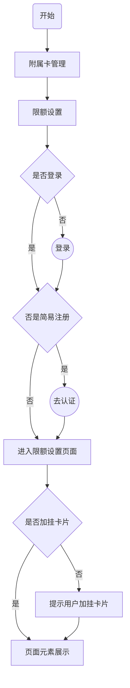

```mermaid
graph TB
    st(开始)-->1[附属卡管理];
    1-->2[限额设置];
    2-->3{是否登录};
    3--否-->4((登录));
    3--是-->5{否是简易注册};
    4-->5;
    5--是-->6((去认证));
    5--否-->7[进入限额设置页面];
    6-->7; 
    7-->8{是否加挂卡片};
    8--否-->9[提示用户加挂卡片];
    8--是-->10[页面元素展示];
    9-->10;
```
